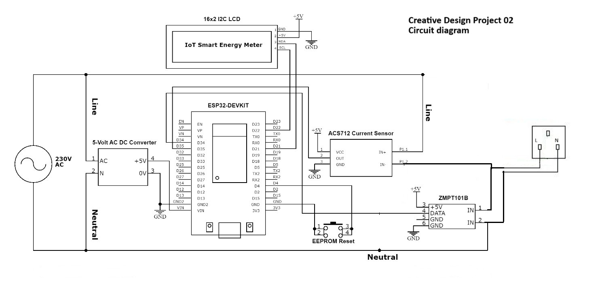

<div align="center">

# ⚡ Voltiva 2.0 — IoT Smart Energy Meter

### Real-time energy monitoring with smart notifications

[](https://www.espressif.com/)
[](https://blynk.io/)
[](https://telegram.org/)
[](LICENSE)

*A comprehensive IoT-based smart energy monitoring system built with ESP32 that tracks voltage, current, power, and energy consumption in real-time — with cloud dashboard visualization and instant Telegram notifications.*

---

**University of Kelaniya** · BECS 31811 — Creative Design Project II · Group 07

---

</div>

## 📋 Table of Contents

- [Overview](#-overview)
- [Features](#-features)
- [System Architecture](#-system-architecture)
- [Hardware Components](#-hardware-components)
- [Circuit Diagram](#-circuit-diagram)
- [Pin Configuration](#-pin-configuration)
- [Software Dependencies](#-software-dependencies)
- [Installation and Setup](#-installation-and-setup)
- [Configuration](#-configuration)
- [Usage](#-usage)
- [CEB Tariff Calculation](#-ceb-tariff-calculation)
- [Blynk Dashboard](#-blynk-dashboard)
- [Telegram Notifications](#-telegram-notifications)
- [Troubleshooting](#-troubleshooting)
- [Team](#-team)
- [License](#-license)

---

## 🔍 Overview

**Voltiva 2.0** is a smart energy meter that monitors household or appliance-level electricity consumption using an ESP32 microcontroller. It measures voltage and current in real-time, calculates energy usage and cost based on the **Sri Lanka CEB tiered tariff structure**, and provides:

- 📊 **Live dashboard** via Blynk IoT platform
- 📱 **Periodic usage reports** via Telegram bot
- 🖥️ **On-device display** via 16x2 I2C LCD
- 💾 **Persistent storage** via EEPROM (survives power outages)
- 🔌 **Plug-out detection** with session-level billing summaries

---

## ✨ Features

| Feature | Description |
|---------|-------------|
| **Real-Time Monitoring** | Measures voltage (Vrms), current (Irms), and apparent power every second |
| **Energy Accumulation** | Tracks cumulative kWh with EEPROM persistence |
| **CEB Tariff Engine** | Calculates cost using Sri Lanka's tiered electricity pricing (6 slabs) |
| **Session Tracking** | Detects plug-in / plug-out events and reports per-session energy and cost |
| **Blynk Dashboard** | Cloud-based real-time visualization of all parameters |
| **Telegram Alerts** | Sends periodic usage updates and plug-out summaries via Telegram bot |
| **LCD Display** | Alternating 2-page display showing V/I/P and Energy/Cost |
| **EEPROM Reset** | Physical button to reset accumulated energy and cost data |
| **Auto-Recovery** | Reads last saved values from EEPROM on boot |

---

## 🏗 System Architecture

```
+----------------+      +-------------+      +--------------------+
|  230V AC       |----->|  ZMPT101B   |----->|                    |
|  Mains         |      |  (Voltage)  |      |                    |
+----------------+      +-------------+      |                    |
                                              |    ESP32           |---- WiFi ----> Blynk Cloud
+----------------+      +-------------+      |    DevKit          |---- WiFi ----> Telegram API
|  Appliance     |----->|  ACS712     |----->|                    |
|  Load          |      |  (Current)  |      |                    |
+----------------+      +-------------+      |                    |
                                              |                    |----> 16x2 I2C LCD
                                              |                    |
                         +-------------+      |                    |
                         | Reset Button|----->|                    |
                         +-------------+      +--------------------+
                                                       |
                                              +--------+--------+
                                              |  5V AC-DC PSU   |
                                              +-----------------+
```

---

## 🔧 Hardware Components

| Component | Specification | Purpose |
|-----------|---------------|---------|
| ESP32-DevKit V1 | Dual-core, WiFi + BLE | Main controller |
| ZMPT101B | AC Voltage Sensor Module | Voltage measurement (230V AC) |
| ACS712 | 5A/20A/30A Current Sensor | Current measurement |
| 16x2 I2C LCD | HD44780 with PCF8574 backpack (0x27) | Local display |
| 5V AC-DC Converter | HLK-PM01 or equivalent | Board power supply |
| Push Button | Momentary, normally open | EEPROM data reset |
| Resistors and Wires | Assorted | Circuit connections |

---

## 📐 Circuit Diagram

<div align="center">



</div>

---

## 📌 Pin Configuration

| ESP32 Pin | Connected To | Function |
|-----------|-------------|----------|
| GPIO 35 | ZMPT101B OUT | Voltage analog input |
| GPIO 34 | ACS712 OUT | Current analog input |
| GPIO 21 (SDA) | LCD SDA | I2C data |
| GPIO 22 (SCL) | LCD SCL | I2C clock |
| GPIO 4 | Push Button (to GND) | EEPROM reset (INPUT_PULLUP) |

---

## 📦 Software Dependencies

Install the following libraries via the **Arduino Library Manager** or **PlatformIO**:

| Library | Version | Purpose |
|---------|---------|---------|
| [EmonLib](https://github.com/openenergymonitor/EmonLib) | Latest | Energy monitoring calculations |
| [Blynk](https://github.com/blynkkk/blynk-library) | 1.3.0+ | IoT cloud dashboard |
| [LiquidCrystal_I2C](https://github.com/johnrickman/LiquidCrystal_I2C) | Latest | I2C LCD driver |
| [ArduinoJson](https://github.com/bblanchon/ArduinoJson) | 6.x+ | JSON serialization for Telegram API |
| WiFi (built-in) | — | ESP32 WiFi connectivity |
| EEPROM (built-in) | — | Persistent data storage |
| Wire (built-in) | — | I2C communication |
| HTTPClient (built-in) | — | HTTP requests to Telegram API |

---

## 🚀 Installation and Setup

### Prerequisites

- [Arduino IDE](https://www.arduino.cc/en/software) (2.0 or newer) or [PlatformIO](https://platformio.org/)
- ESP32 board package installed ([guide](https://docs.espressif.com/projects/arduino-esp32/en/latest/installing.html))
- A [Blynk IoT](https://blynk.io/) account (free tier works)
- A [Telegram Bot](https://core.telegram.org/bots#how-do-i-create-a-bot) with token and chat ID

### Steps

1. **Clone the repository**

```bash
git clone https://github.com/ushansamudithaperera/Creative-Design-Project.git
cd Creative-Design-Project
```

2. **Install libraries** — Use the Arduino Library Manager or add them to `platformio.ini`.

3. **Configure credentials** — Open the `.ino` file and update:

```cpp
#define BLYNK_TEMPLATE_ID   "YOUR_TEMPLATE_ID"
#define BLYNK_TEMPLATE_NAME "YOUR_TEMPLATE_NAME"
#define BLYNK_AUTH_TOKEN    "YOUR_AUTH_TOKEN"

const char* telegramBotToken = "YOUR_BOT_TOKEN";
const char* telegramChatID   = "YOUR_CHAT_ID";

const char ssid[] = "YOUR_WIFI_SSID";
const char pass[] = "YOUR_WIFI_PASSWORD";
```

4. **Calibrate sensors** — Adjust the calibration constants to match your specific sensor modules:

```cpp
const float vCalibration    = 125.10;  // Tune with a known voltage source
const float currCalibration = 1.89;    // Tune with a known load
```

5. **Upload** — Select **ESP32 Dev Module** as your board and upload the sketch.

---

## ⚙️ Configuration

### Blynk Virtual Pins

| Virtual Pin | Data | Type |
|-------------|------|------|
| V0 | Voltage (Vrms) | Gauge / Value Display |
| V1 | Current (Irms) | Gauge / Value Display |
| V2 | Apparent Power (W) | Gauge / Value Display |
| V3 | Energy (kWh) | Value Display |
| V4 | Cost (Rs.) | Value Display |

### Timer Intervals

| Interval | Function | Default |
|----------|----------|---------|
| Energy data update | `sendEnergyDataToBlynk()` | 1 second |
| LCD page switch | `changeDisplayPage()` | 2 seconds |
| Telegram report | `sendBillToTelegram()` | 60 seconds |

---

## 📖 Usage

1. **Power on** the device — the LCD will display a **"Welcome to Voltiva 2.0"** splash screen for 3 seconds.
2. The system automatically connects to your WiFi and Blynk cloud.
3. **Plug in an appliance** — the system begins session tracking when current exceeds **0.1A**.
4. Monitor live data on:
   - 🖥️ **LCD** — alternates between Voltage/Current/Power and Energy/Cost pages every 2 seconds
   - 📱 **Blynk App** — real-time gauges and value widgets
   - 💬 **Telegram** — receives a usage report every 60 seconds
5. **Unplug the appliance** — receives a Telegram message with the session summary (duration, energy, cost).
6. **Press the reset button** (GPIO 4) to zero out accumulated kWh and cost data.

---

## 💰 CEB Tariff Calculation

The system implements the **Ceylon Electricity Board (CEB)** domestic tiered tariff structure:

| Slab | Units (kWh) | Energy Charge (Rs/kWh) | Fixed Charge (Rs/month) |
|------|-------------|------------------------|------------------------|
| 1 | 0 - 30 | 8.00 | 120.00 |
| 2 | 31 - 60 | 10.00 | 240.00 |
| 3 | 61 - 90 | 16.00 | 360.00 |
| 4 | 91 - 120 | 32.00 | 480.00 |
| 5 | 121 - 180 | 45.00 | 540.00 |
| 6 | 180+ | 50.00 | 600.00 |

> **Note:** The fixed charge is prorated based on actual consumption within each slab.

---

## 📊 Blynk Dashboard

Set up the following widgets in your Blynk dashboard:

| Widget | Virtual Pin | Suggested Range |
|--------|-------------|----------------|
| Gauge — Voltage | V0 | 0 - 300 V |
| Gauge — Current | V1 | 0 - 30 A |
| Gauge — Power | V2 | 0 - 5000 W |
| Value Display — Energy | V3 | — |
| Value Display — Cost | V4 | — |

---

## 📱 Telegram Notifications

The bot sends two types of messages:

### Periodic Usage Update (every 60 seconds)

```
🔌 Voltiva 2.0 Usage Update
⚡ Voltage: 228.5 V
💡 Current: 1.23 A
🔋 Power: 281.06 W
📊 Total Energy: 0.004685 kWh
💰 Total Cost: Rs. 0.037480
```

### Plug-Out Session Summary

```
🔌 Plugged off after 15.30 min
📊 Session Energy: 0.0712 kWh
💰 Session Cost: Rs. 0.569600
```

---

## 🔨 Troubleshooting

| Issue | Solution |
|-------|----------|
| LCD shows nothing | Check I2C address (try `0x3F` instead of `0x27`). Run an I2C scanner sketch. |
| WiFi won't connect | Verify SSID/password. Ensure 2.4 GHz network (ESP32 does not support 5 GHz). |
| Voltage reads 0 | Check ZMPT101B wiring to GPIO 35. Verify AC input connection. |
| Current reads 0 | Check ACS712 wiring to GPIO 34. Ensure load is actually drawing current. |
| Blynk offline | Verify auth token, template ID, and internet connectivity. |
| Telegram not sending | Check bot token and chat ID. Ensure bot is not blocked. |
| Cost not calculating | Confirm kWh is accumulating. Press reset button and test with a known load. |

---

## 👥 Team

**Group 07** — BECS 31811 Creative Design Project II

**University of Kelaniya**, Faculty of Computing and Technology

---

## 📄 License

This project is developed as part of an academic course module. Feel free to use and modify for educational purposes.

---

<div align="center">

**Made with ❤️ and ESP32**

⚡ *Voltiva 2.0 — Know what you consume* ⚡

</div>
